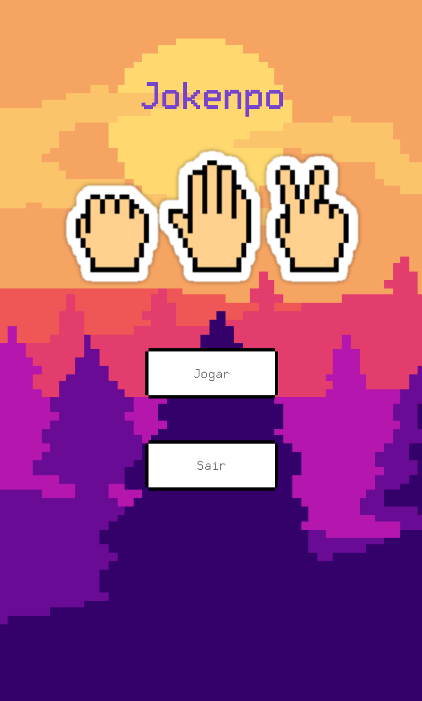
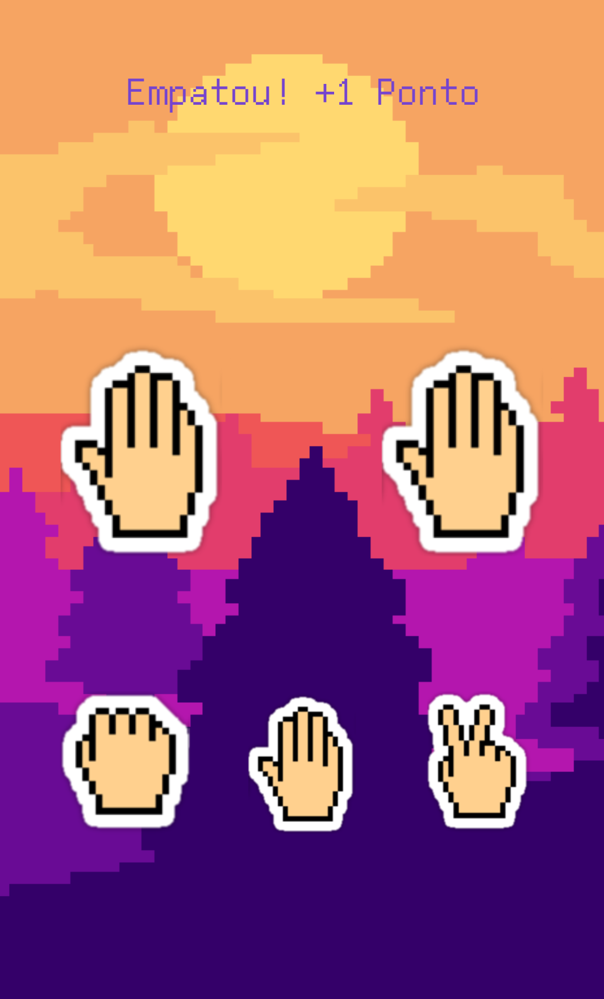

# Jokenpo Game App

A simple rock-paper-scissors game developed using Kotlin.

  
  

## Game Language

The currently only supported language is Portuguese

## Contributing

Feel free to add issues with bugs or ideas. Any pull requests are very welcome!
